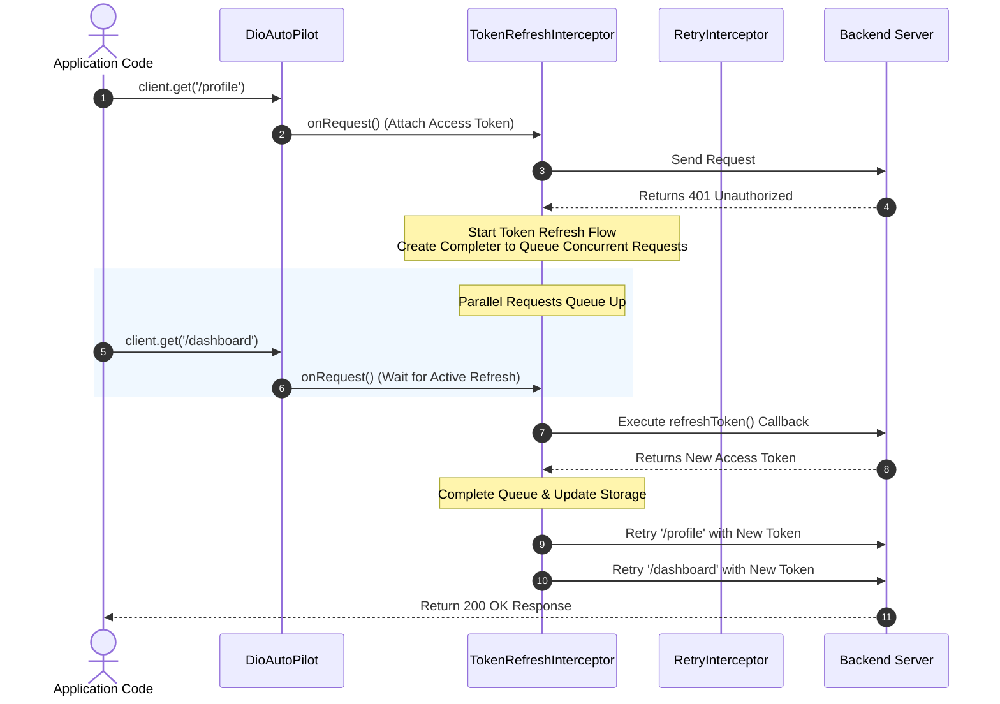

# dio_auto_pilot

[](https://pub.dev/packages/dio_auto_pilot)
[](https://opensource.org/licenses/MIT)

`dio_auto_pilot` is a powerful, production-ready wrapper around the [Dio](https://pub.dev/packages/dio) HTTP client. It adds automatic exponential-backoff retries and pluggable authentication/token-refresh interceptors to keep your network layers robust and reliable with minimal boilerplate.

---

## How It Works (Production / Publish Mode Flow)

To keep your application robust in production, the library coordinates network requests, retries, and authentication refresh flows under the hood:



### 1. Request Interception
When you make an API call, `onRequest` automatically retrieves the current access token via `getToken()` and injects it into the request headers. If a token refresh is already in progress, the request pauses and waits for the new token before proceeding.

### 2. The 401 Unauthorized Trigger
If a request fails with a `401 Unauthorized` status code, the error is intercepted. 
- The **first** request that receives a 401 starts the token refresh process and creates a shared `Completer`.
- Any **concurrent** requests that also encounter a 401 (or are fired while the refresh is active) detect the active `Completer` and wait for it. This guarantees that **only one** refresh request is sent to your auth server.

### 3. Replaying the Queue
Once the token is successfully refreshed, the interceptor updates the header of all pending requests, marks them so they aren't retried indefinitely, and replays them. If the refresh fails, all pending requests fail with the original 401 error.

---

## Getting Started

### 1. Add the Dependency

Add `dio_auto_pilot` and `dio` to your Flutter project's `pubspec.yaml` file:

```yaml
dependencies:
  flutter:
    sdk: flutter
  
  # Add these dependencies
  dio: ^5.10.0
  dio_auto_pilot: ^0.1.0
```

Here is where this fits inside your project structure:

```text
my_flutter_app/            # Your Flutter project directory
  ├── lib/
  │    └── main.dart       # Where you import the client: import 'package:dio_auto_pilot/dio_auto_pilot.dart';
  └── pubspec.yaml         # <--- Add the dependencies here
```

### 2. Fetch the Packages

Run the following command in your terminal inside the project directory:

```bash
flutter pub get
```

---

## Production Usage Guide

### 1. Initialization with Secure Storage

In production, you typically store tokens in secure storage (e.g., `flutter_secure_storage`). Define `AuthOptions` to fetch, refresh, and save your tokens.

> [!IMPORTANT]
> When performing the refresh request inside the `refreshToken` callback, use a **separate, clean instance of Dio** (not the `DioAutoPilot` instance) to avoid circular request dependency and infinite loops.

```dart
import 'package:dio/dio.dart';
import 'package:dio_auto_pilot/dio_auto_pilot.dart';

// Setup secure storage instance
final secureStorage = MySecureStorage(); 

final client = DioAutoPilot(
  // Configure retries
  retryOptions: RetryOptions(
    maxAttempts: 3,
    initialDelay: Duration(seconds: 1),
    maxDelay: Duration(seconds: 15),
  ),
  // Configure authentication and token refresh
  authOptions: AuthOptions(
    // 1. Fetch current token
    getToken: () async => await secureStorage.read(key: 'access_token'),
    
    // 2. Identify if response is unauthorized
    isUnauthorized: (response) => response.statusCode == 401,
    
    // 3. Refresh token flow (Uses a separate Dio instance)
    refreshToken: () async {
      final refreshDio = Dio(BaseOptions(baseUrl: 'https://api.example.com'));
      final refreshToken = await secureStorage.read(key: 'refresh_token');

      try {
        final response = await refreshDio.post(
          '/auth/refresh',
          data: {'refreshToken': refreshToken},
        );
        
        final newAccessToken = response.data['accessToken'];
        final newRefreshToken = response.data['refreshToken'];

        // Save new tokens
        await secureStorage.write(key: 'access_token', value: newAccessToken);
        await secureStorage.write(key: 'refresh_token', value: newRefreshToken);

        return newAccessToken; // Return the new token
      } catch (e) {
        // Token refresh failed (e.g., refresh token expired)
        // Handle logout or clear session here
        await secureStorage.deleteAll();
        return null; 
      }
    },
    // Optional callback after token is updated
    onTokenRefreshed: (newToken) {
      print('Token successfully refreshed and stored: $newToken');
    },
  ),
);
```

### 2. How to Call Authenticated APIs

By default, all requests require authentication and will have the token attached automatically.

```dart
// Token is automatically fetched from storage and attached as:
// "Authorization: Bearer <token>"
final response = await client.get('/user/profile');
print(response.data);
```

### 3. How to Call Public APIs (Excluding Auth Header)

For endpoints that must not send authentication headers (like login or signup), disable authorization by passing `requiresAuth: false` in the request options.

```dart
// Excludes auth headers and skips token-refresh interception
final response = await client.post(
  '/auth/login',
  data: {
    'email': 'user@example.com',
    'password': 'securepassword',
  },
  options: Options(
    extra: {'requiresAuth': false},
  ),
);

// Save the initial tokens on successful login
await secureStorage.write(key: 'access_token', value: response.data['accessToken']);
await secureStorage.write(key: 'refresh_token', value: response.data['refreshToken']);
```

### 4. Customizing Retry Decisions

You can customize the retry behavior (e.g. retrying only on specific exceptions or server status codes).

```dart
final client = DioAutoPilot(
  retryOptions: RetryOptions(
    maxAttempts: 4,
    retryEvaluator: (error) {
      // Retry on network timeouts
      if (error.type == DioExceptionType.connectionTimeout ||
          error.type == DioExceptionType.connectionError) {
        return true;
      }
      
      // Retry on HTTP 429 Too Many Requests or HTTP 503 Service Unavailable
      final statusCode = error.response?.statusCode;
      return statusCode == 429 || statusCode == 503;
    },
  ),
);
```

---

## Contributing

Contributions are welcome! Please open an issue or submit a pull request on the [GitHub repository](https://github.com/hrikhan/dio_auto_pilot).

## License

This project is licensed under the MIT License - see the [LICENSE](LICENSE) file for details.
# dio_auto_pilot
